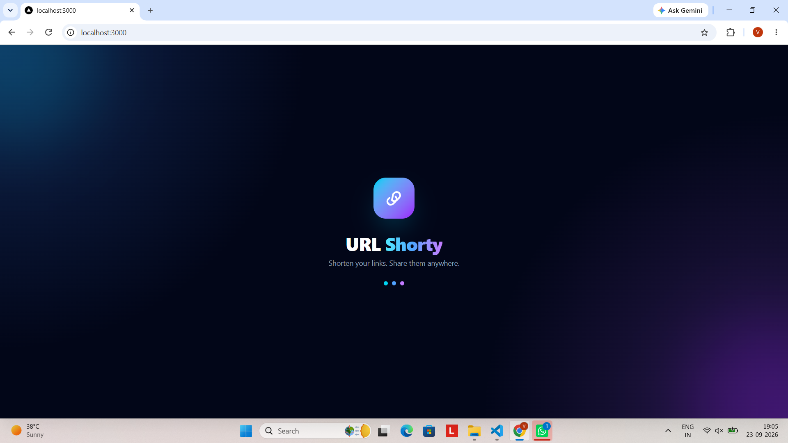
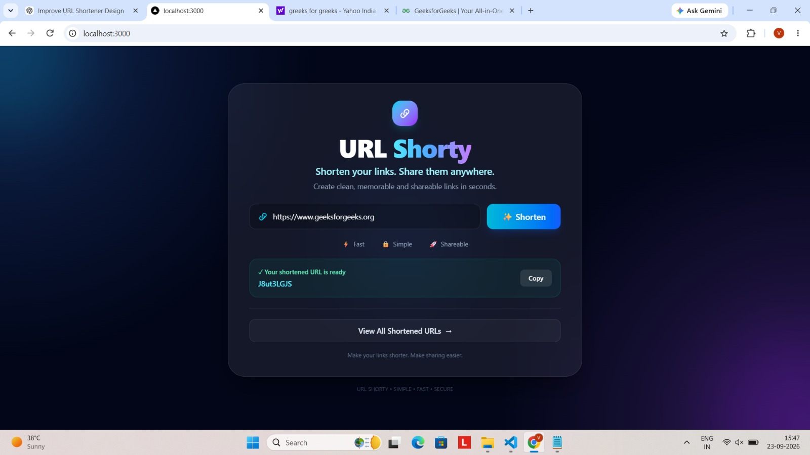
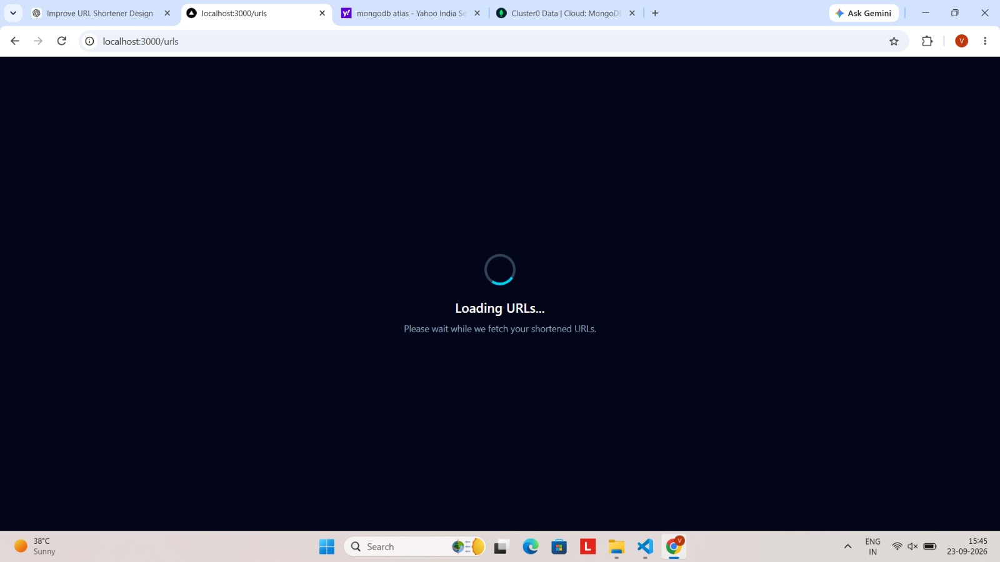
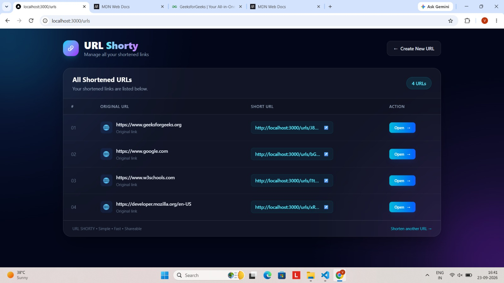
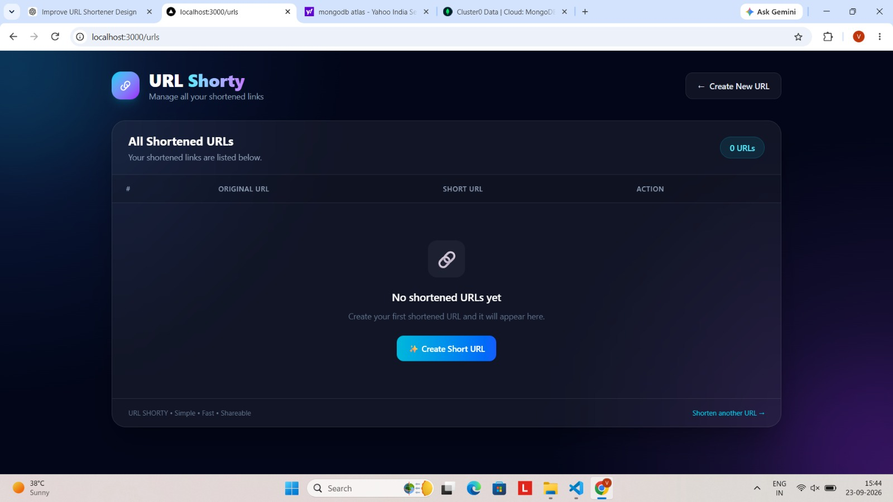

# 🔗 URL Shortener

A full-stack URL shortening application built with Next.js, TypeScript, MongoDB, and DaisyUI.

## 🚀 Demo
<video src="./public/url-shorty(1).mp4"></video>
<video src="./public/url-shorty.mp4"></video>


## 📸 Screenshots

### Splash Screen


### Home Page



### Loading Page


### URLs Page



### URL Page With No-Urls



## ✨ Features

- 🔗 Create short URLs from long URLs
- 📋 Copy shortened URLs easily
- 📊 View all created URLs
- 🔍 View URL details
- ⚡ Fast and responsive UI
- 💾 MongoDB database integration
- 🎨 DaisyUI-based interface
- 📱 Responsive design

## 🛠️ Tech Stack

- Next.js
- TypeScript
- MongoDB
- Mongoose
- DaisyUI
- Tailwind CSS
- REST API
- Server Actions

## 📁 Project Structure

```text
app/
├── api/
├── serverActions/
├── urls/
├── SplashScreen.tsx
├── page.tsx
└── layout.tsx

config/
models/
repositories/
services/